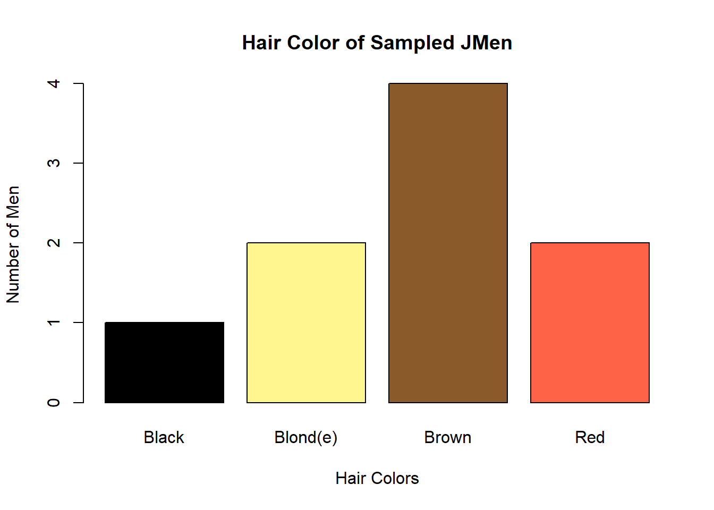

```{r setup, include=FALSE}
knitr::opts_chunk$set(echo = TRUE)
```

## Introduction
The goal of this exercise is to reproduce a barchart displaying the number of men having each respective hair color. My goal is to copy the bar chart exactly, including the proper colors and labels.

## Target Graph

 ```{r targetGraph, echo=FALSE, out.width='50%'}
 
```  

This is the target graph that I will try to imitate. 


## Imitation Graph
```{r graph, include = TRUE}
jmen <- read.table("data/jmen.txt", header = TRUE)
barplot(table(jmen$Hair), col=c("Black","khaki1","tan4", "tomato"), main="Hair Color of Sampled JMen", xlab="Hair Colors",ylab="Number of Men", names.arg=c("Black","Blond(e)","Brown","Red"))
```  
I have accurately recreated the information present in the target graph. The numbers for each of the men and their corresponding hair color is correct as well as the relative heights of the bars.
